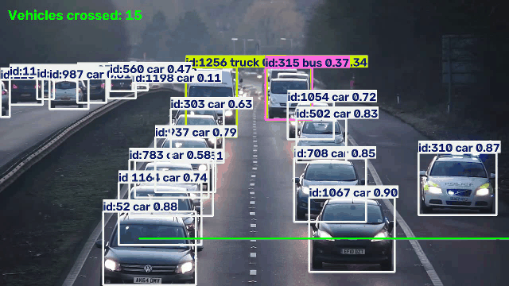

# 🚗 Real-Time Vehicle Detection, Tracking & Counting

A computer vision project for real-time vehicle detection, multi-object tracking, and line-crossing vehicle counting using **YOLOv8, ByteTrack, OpenCV, and Supervision**.

## 🎥 Demo



A demonstration of the project showing real-time vehicle detection, tracking IDs, and line-crossing counting.

### ▶️ Full Demo

[🎬 View / Download Full Demo Video](https://github.com/nandhu-prakash/real-time-vehicle-detection-tracking/releases/tag/v1.0.0)

## ✨ Features

- 🚗 Vehicle detection using YOLOv8
- 🎯 Multi-object tracking using ByteTrack
- 🆔 Unique tracking IDs for detected vehicles
- 📏 Line-crossing detection
- 🔢 Vehicle counting
- 🎥 Processed video output
- 💻 CPU-compatible implementation

## 🧠 Technologies Used

- Python
- YOLOv8
- Ultralytics
- OpenCV
- ByteTrack
- Supervision
- Jupyter Notebook

## 🚘 Vehicle Classes

The current implementation tracks:

| Class | YOLO Class ID |
|---|---:|
| 🚗 Car | 2 |
| 🏍️ Motorcycle | 3 |
| 🚌 Bus | 5 |
| 🚛 Truck | 7 |

## 🔄 Project Workflow

```text
Input Video
     ↓
YOLOv8 Object Detection
     ↓
ByteTrack Multi-Object Tracking
     ↓
Unique Vehicle IDs
     ↓
Track Center Points
     ↓
Line-Crossing Detection
     ↓
Vehicle Counting
     ↓
Output Video

## ⚙️ Installation

Clone the repository:

```bash
git clone https://github.com/nandhu-prakash/real-time-vehicle-detection-tracking.git
